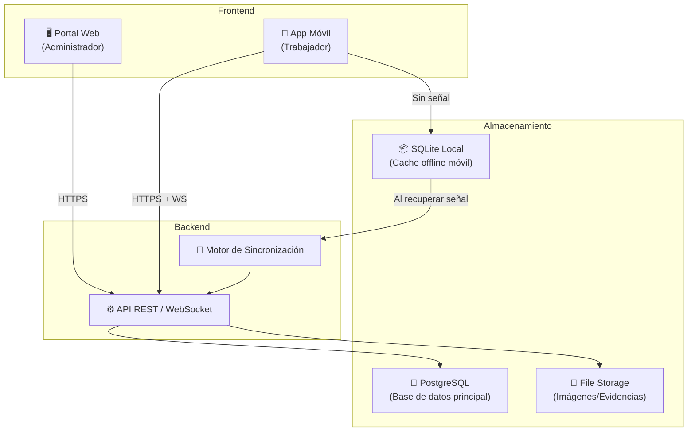
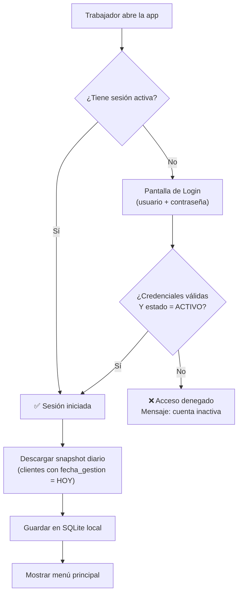
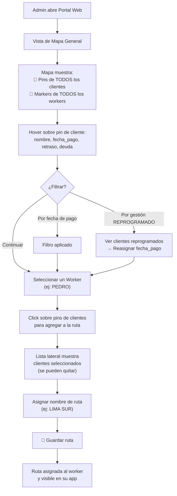
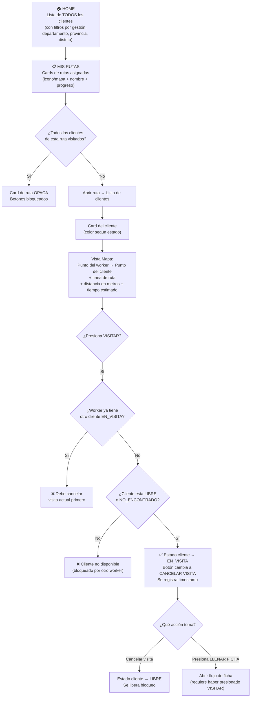
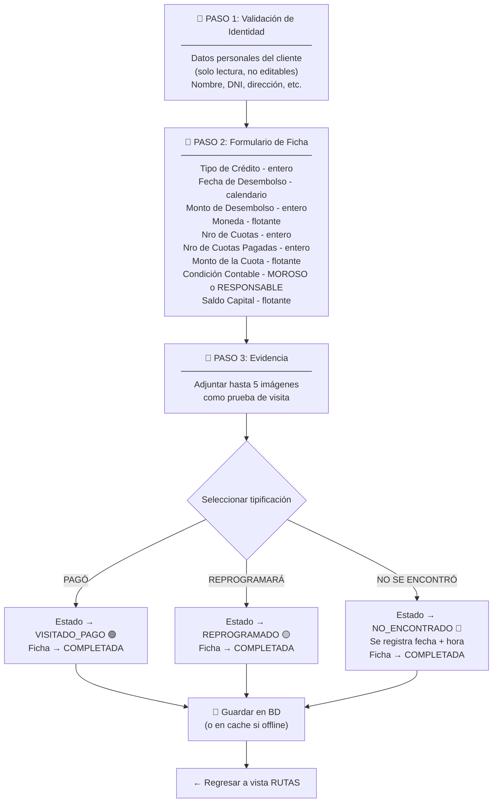
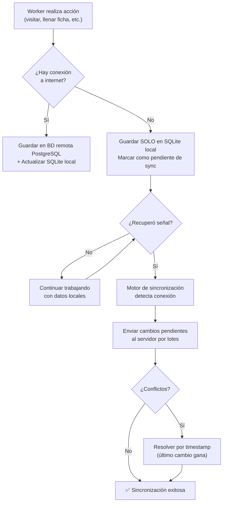
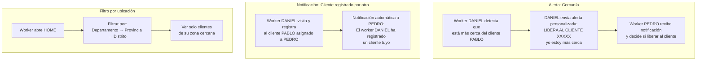
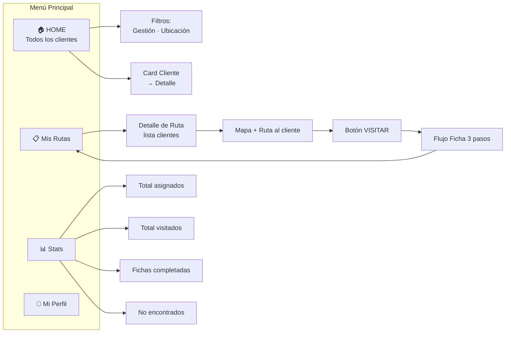

# 🗺️ Ruta Zero — Diagrama de Flujo del Sistema

> **Versión:** 1.0 · **Fecha:** 2026-04-16
> **Metodología:** 3F (Forma · Fondo · Flujo)

---

## 1. Arquitectura General

---

## 2. Catálogo de Estados

### 2.1 Estados del Cliente (respecto a gestión)

| Estado | Color Card | Significado | ¿Visitable? |
|---|---|---|---|
| `LIBRE` | 🔵 Azul | Sin gestión, disponible | ✅ Sí |
| `EN_VISITA` | 🟣 Morado | Un worker está en camino / visitando | ❌ No (bloqueado) |
| `VISITADO_PAGO` | 🟢 Verde | Ficha completa, cliente pagó | ❌ No |
| `REPROGRAMADO` | 🟡 Amarillo | Ficha guardada, se reprogramará visita | ⚠️ Solo admin reasigna fecha |
| `NO_ENCONTRADO` | 🔴 Rojo | No se encontró al cliente (con fecha/hora) | ✅ Sí (otro worker o mismo, pasado un tiempo) |

> **IMPORTANTE:** El estado del cliente es **global**: todos los workers ven el mismo estado en tiempo real, independientemente de si el cliente les fue asignado.

### 2.2 Estados del Worker (jornada laboral)

| Estado | Significado |
|---|---|
| `INACTIVO` | No ha iniciado sesión hoy |
| `JORNADA_INICIADA` | Inició su día de trabajo |
| `EN_CAMINO` | Se dirige a visitar a un cliente |
| `LLENANDO_FICHA` | Está completando el formulario de un cliente |
| `ALMUERZO` | En horario de almuerzo |
| `TIEMPO_MUERTO` | Sin actividad registrada / sin señal |
| `JORNADA_FINALIZADA` | Marcó fin de jornada |

### 2.3 Estados de la Ficha

| Estado | Significado |
|---|---|
| `SIN_DATOS` | Ficha vacía, nunca se abrió |
| `EN_PROCESO` | Se abrió pero no se completó |
| `COMPLETADA` | Guardada exitosamente con tipificación |

---

## 3. Flujo de Autenticación (App Móvil)

> **NOTA:** Al iniciar sesión se descarga el **snapshot del día**: todos los clientes cuya `fecha_gestion` es la fecha actual. Este snapshot alimenta la app durante toda la jornada, incluso sin internet.

---

## 4. Flujo del Administrador — Creación de Rutas

---

## 5. Flujo del Worker — Visita a Cliente

Este es el flujo principal de la app móvil.

> **ADVERTENCIA — Bloqueo exclusivo:** Un worker solo puede tener **un cliente en estado `EN_VISITA`** a la vez. Ningún otro worker puede visitar ese cliente mientras esté bloqueado.

---

## 6. Flujo de Llenado de Ficha (3 Pasos)

> **TIP:** Al guardar, se registran automáticamente los **timestamps de monitoreo**: hora de apertura de ficha, hora de cierre, y duración total.

---

## 7. Flujo de Sincronización Offline / Online

> **IMPORTANTE:** Los datos que se cachean localmente al inicio de sesión incluyen: `id_cliente`, `id_ficha`, `id_worker`, y toda la información necesaria para operar sin conexión durante la jornada.

---

## 8. Flujo de Alertas y Notificaciones

---

## 9. Navegación de la App Móvil (Mapa de Pantallas)

---

## 10. Panel del Administrador (Portal Web)

```mermaid
flowchart TB
    subgraph "Portal Web — Módulos"
        DASH["📊 Dashboard<br/>KPIs y métricas"]
        WORKERS["👷 Gestión Workers<br/>CRUD + estados"]
        CLIENTS["👥 Gestión Clientes<br/>Fichas + búsqueda"]
        ROUTES["🗺️ Creador de Rutas<br/>Mapa interactivo"]
        LOGS["📋 Logs de Gestión<br/>Avances por worker"]
        ALERTS["🔔 Alertas"]
    end

    DASH --> D1["Clientes totales vs visitados"]
    DASH --> D2["Workers activos / almuerzo / finalizados"]
    DASH --> D3["Rutas completadas"]
    DASH --> D4["Clientes por estado"]

    WORKERS --> W1["Crear / Editar / Desactivar"]
    WORKERS --> W2["Ver estado en tiempo real"]
    WORKERS --> W3["Ver jornada: inicio, almuerzo, fin"]

    CLIENTS --> C1["Búsqueda por nombre/DNI"]
    CLIENTS --> C2["Ver ficha completa"]
    CLIENTS --> C3["Historial de gestiones"]

    ROUTES --> CREAR_RUTA["Flujo de creación<br/>(ver sección 4)"]
```

---

## 11. Reglas de Negocio Consolidadas

| # | Regla | Módulo |
|---|---|---|
| RN-01 | Un worker solo puede tener **1 cliente en `EN_VISITA`** a la vez | App Móvil |
| RN-02 | Solo se puede llenar ficha si previamente se presionó `VISITAR` | App Móvil |
| RN-03 | Un cliente `EN_VISITA` está **bloqueado** para todos los demás workers | Global |
| RN-04 | Los estados de cliente son **globales y en tiempo real** | Global |
| RN-05 | `NO_ENCONTRADO` registra fecha+hora y el cliente **vuelve a ser visitable** | App Móvil |
| RN-06 | Si todos los clientes de una ruta fueron visitados, la card se pone **opaca** y botones se **bloquean** | App Móvil |
| RN-07 | Al guardar ficha/tipificación se retorna automáticamente a la vista de Rutas | App Móvil |
| RN-08 | El snapshot diario se descarga al iniciar sesión (clientes con `fecha_gestion = HOY`) | App Móvil |
| RN-09 | Los datos offline se sincronizan automáticamente al recuperar conexión | App Móvil |
| RN-10 | Las imágenes de evidencia se almacenan en filesystem, solo la ruta en BD | Backend |
| RN-11 | El admin puede filtrar clientes por fecha de pago y por gestión `REPROGRAMADO` | Portal Web |
| RN-12 | Un worker solo puede loguearse si su estado en BD es `ACTIVO` | Backend |
| RN-13 | Cada acción del worker se registra con timestamp para monitoreo | Backend |

---

> **3F Aplicadas:**
> - **Forma:** Catálogos normalizados de estados, colores y tipificaciones. Nomenclatura consistente.
> - **Fondo:** Todas las reglas de negocio documentadas. Datos del cliente, ficha, evidencias y monitoreo sin pérdida.
> - **Flujo:** Navegación lineal en la app (Rutas → Cliente → Mapa → Visitar → Ficha → Regreso). Sincronización bidireccional offline/online.
