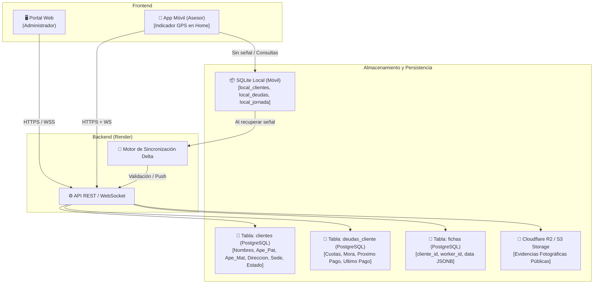
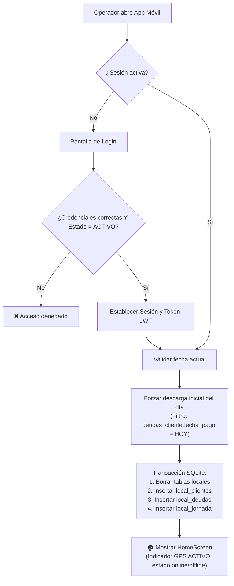
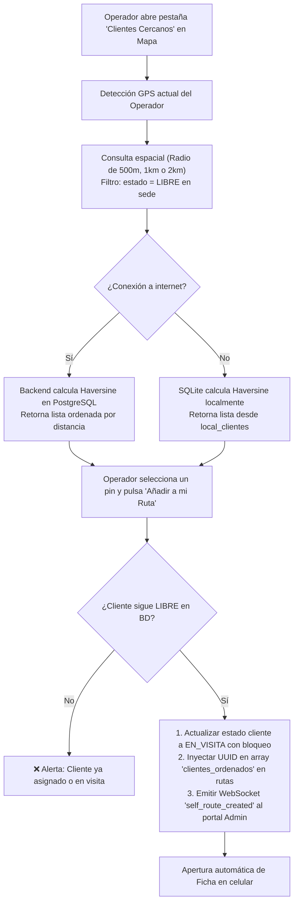
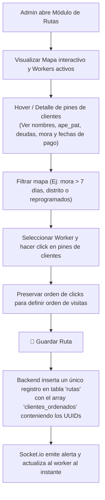
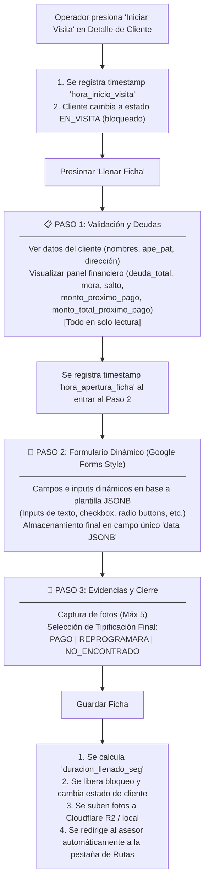

# 🗺️ Routing — Diagrama de Flujo y Reglas de Negocio del Sistema
### Versión 2.0 · Mayo 2026
#### Metodología: 3F (Forma · Fondo · Flujo) — Edición Empresa y Finanzas

---

## 1. Arquitectura General y Flujo de Datos

El sistema funciona mediante una arquitectura **Offline-First**, donde el cliente web de administración interactúa con PostgreSQL en tiempo real vía WebSockets/HTTPS, mientras que los operadores de campo consumen la base de datos interna SQLite de sus dispositivos móviles, sincronizando deltas al detectar conexión.


```mermaid
graph TB
    subgraph "Frontend"
        WEB["🖥️ Portal Web<br/>(Administrador)"]
        APP["📱 App Móvil (Asesor)<br/>[Indicador GPS en Home]"]
    end

    subgraph "Backend (Render)"
        API["⚙️ API REST / WebSocket"]
        SYNC["🔄 Motor de Sincronización Delta"]
    end

    subgraph "Almacenamiento y Persistencia"
        PG_C["🐘 Tabla: clientes (PostgreSQL)<br/>[Nombres, Ape_Pat, Ape_Mat, Direccion, Sede, Estado]"]
        PG_D["🐘 Tabla: deudas_cliente (PostgreSQL)<br/>[Cuotas, Mora, Proximo Pago, Ultimo Pago]"]
        PG_F["🐘 Tabla: fichas (PostgreSQL)<br/>[cliente_id, worker_id, data JSONB]"]
        CACHE["📦 SQLite Local (Móvil)<br/>[local_clientes, local_deudas, local_jornada]"]
        R2["📁 Cloudflare R2 / S3 Storage<br/>[Evidencias Fotográficas Públicas]"]
    end

    WEB -->|HTTPS / WSS| API
    APP -->|HTTPS + WS| API
    APP -->|Sin señal / Consultas| CACHE
    CACHE -->|Al recuperar señal| SYNC
    SYNC -->|Validación / Push| API
    API --> PG_C
    API --> PG_D
    API --> PG_F
    API --> R2
```

---

## 2. Catálogo de Estados

### 2.1 Estados del Cliente (Respecto a Gestión)

| Estado | Color Card | Significado | ¿Visitable? |
|---|---|---|---|
| `LIBRE` | 🔵 Azul | Cliente sin gestión activa en el día, disponible para visita. | ✅ Sí |
| `EN_VISITA` | 🟣 Morado | Un operador ha iniciado visita. Bloqueado exclusivamente para otros operadores. | ❌ No |
| `VISITADO_PAGO` | 🟢 Verde | Visita completada. Se guardó ficha con tipificación de PAGO. | ❌ No |
| `REPROGRAMADO` | 🟡 Amarillo | Visita completada. Se reprogramó la fecha de cobro. | ⚠️ Solo Admin / Ingesta |
| `NO_ENCONTRADO` | 🔴 Rojo | El asesor no ubicó al cliente. El cliente vuelve a estar disponible para visita. | ✅ Sí |

> **REGLA DE ORO:** El estado del cliente es **global** en PostgreSQL y se actualiza al instante en la app mediante sincronización o WebSockets (`ficha_completed`, `visit_started`).

### 2.2 Estados del Operador (Jornada Laboral)

| Estado | Significado |
|---|---|
| `INACTIVO` | No ha iniciado sesión hoy o jornada cerrada. |
| `JORNADA_INICIADA` | Entrada marcada. Se registra hora de inicio de sesión y corre el cronómetro. |
| `EN_REFRIGERIO` | Horario de refrigerio/almuerzo activo. Descuenta del cálculo de horas trabajadas. |
| `JORNADA_FINALIZADA` | Salida marcada. Termina el día laboral. |

### 2.3 Estados de la Ficha
*   `SIN_DATOS`: Cliente nunca visitado.
*   `EN_PROCESO`: El asesor inició la visita, pero aún no guarda el formulario.
*   `COMPLETADA`: Ficha guardada con tipificación y firma de evidencias en la nube.

---

## 3. Flujo de Autenticación y Carga Offline (SQLite)

Este flujo garantiza que el operador comience su día con todos los datos necesarios descargados localmente en su SQLite, filtrando estrictamente por clientes cuya **fecha de pago es hoy**.


```mermaid
flowchart TD
    A["Operador abre App Móvil"] --> B{"¿Sesión activa?"}
    B -- No --> C["Pantalla de Login"]
    C --> D{"¿Credenciales correctas Y Estado = ACTIVO?"}
    D -- No --> E["❌ Acceso denegado"]
    D -- Sí --> F["Establecer Sesión y Token JWT"]
    B -- Sí --> G["Validar fecha actual"]
    F --> G
    
    G --> H["Forzar descarga inicial del día<br/>(Filtro: deudas_cliente.fecha_pago = HOY)"]
    H --> I["Transacción SQLite:<br/>1. Borrar tablas locales<br/>2. Insertar local_clientes<br/>3. Insertar local_deudas<br/>4. Insertar local_jornada"]
    I --> J["🏠 Mostrar HomeScreen<br/>(Indicador GPS ACTIVO, estado online/offline)"]
```

---

## 4. Flujo de Auto-Asignación por Proximidad (Self-Routing)

Permite que el asesor se asigne a sí mismo clientes libres que se encuentren dentro de su rango GPS, inyectándolos en su ruta diaria sin intervención manual del administrador.


```mermaid
flowchart TD
    A["Operador abre pestaña 'Clientes Cercanos' en Mapa"] --> B["Detección GPS actual del Operador"]
    B --> C["Consulta espacial (Radio de 500m, 1km o 2km)<br/>Filtro: estado = LIBRE en sede"]
    C --> D{"¿Conexión a internet?"}
    
    D -- Sí --> E["Backend calcula Haversine en PostgreSQL<br/>Retorna lista ordenada por distancia"]
    D -- No --> F["SQLite calcula Haversine localmente<br/>Retorna lista desde local_clientes"]
    
    E --> G["Operador selecciona un pin y pulsa 'Añadir a mi Ruta'"]
    F --> G
    
    G --> H{"¿Cliente sigue LIBRE en BD?"}
    H -- No --> I["❌ Alerta: Cliente ya asignado o en visita"]
    H -- Sí --> J["1. Actualizar estado cliente a EN_VISITA con bloqueo<br/>2. Inyectar UUID en array 'clientes_ordenados' en rutas<br/>3. Emitir WebSocket 'self_route_created' al portal Admin"]
    J --> K["Apertura automática de Ficha en celular"]
```

---

## 5. Flujo del Administrador — Creación y Control de Rutas

El administrador gestiona todo el mapa operativo y define las asignaciones de rutas optimizadas a través de arrays compactados de UUIDs de clientes.


```mermaid
flowchart TD
    A["Admin abre Módulo de Rutas"] --> B["Visualizar Mapa interactivo y Workers activos"]
    B --> C["Hover / Detalle de pines de clientes<br/>(Ver nombres, ape_pat, deudas, mora y fechas de pago)"]
    C --> D["Filtrar mapa (Ej: mora > 7 días, distrito o reprogramados)"]
    D --> E["Seleccionar Worker y hacer click en pines de clientes"]
    E --> F["Preservar orden de clicks para definir orden de visitas"]
    F --> G["💾 Guardar Ruta"]
    G --> H["Backend inserta un único registro en tabla 'rutas'<br/>con el array 'clientes_ordenados' conteniendo los UUIDs"]
    H --> I["Socket.io emite alerta y actualiza al worker al instante"]
```

---

## 6. Flujo de Llenado de Ficha Dinámica (3 Pasos Críticos)

El flujo de ficha requiere control estricto de tiempos y de lectura dinámica para adaptarse a las plantillas creadas en el sistema.


```mermaid
flowchart TD
    A["Operador presiona 'Iniciar Visita' en Detalle de Cliente"] --> B["1. Se registra timestamp 'hora_inicio_visita'<br/>2. Cliente cambia a estado EN_VISITA (bloqueado)"]
    B --> C["Presionar 'Llenar Ficha'"]
    
    C --> D["📋 PASO 1: Validación y Deudas<br/>─────────────────────────────<br/>Ver datos del cliente (nombres, ape_pat, dirección)<br/>Visualizar panel financiero (deuda_total, mora, salto,<br/>monto_proximo_pago, monto_total_proximo_pago)<br/>[Todo en solo lectura]"]
    
    D --> E["Se registra timestamp 'hora_apertura_ficha' al entrar al Paso 2"]
    
    E --> F["📝 PASO 2: Formulario Dinámico (Google Forms Style)<br/>─────────────────────────────<br/>Campos e inputs dinámicos en base a plantilla JSONB<br/>(Inputs de texto, checkbox, radio buttons, etc.)<br/>Almacenamiento final en campo único 'data JSONB'"]
    
    F --> G["📸 PASO 3: Evidencias y Cierre<br/>─────────────────────────────<br/>Captura de fotos (Máx 5)<br/>Selección de Tipificación Final:<br/>PAGO | REPROGRAMARA | NO_ENCONTRADO"]
    
    G --> H["Guardar Ficha"]
    H --> I["1. Se calcula 'duracion_llenado_seg'<br/>2. Se libera bloqueo y cambia estado de cliente<br/>3. Se suben fotos a Cloudflare R2 / local<br/>4. Se redirige al asesor automáticamente a la pestaña de Rutas"]
```

---

## 7. Flujo del Motor de Ingesta Masiva y Exportación

Manejo de archivos de entrada y salida para integrarse con el core financiero.

### 7.1 Ingesta Masiva (Excel Input)
```
[Admin sube Excel .xlsx] ──> [Validar cabeceras requeridas]
                                     │
                             ¿Todo correcto?
                                     │
          ┌──────────────────────────┴──────────────────────────┐
         (SÍ)                                                  (NO)
          │                                                     │
[Iniciar bloque TRANSACCION (BEGIN)]                      [Rechazar archivo]
  │
  ├─> 1. Insertar dirección en 'ubicaciones' (obtener ID)
  ├─> 2. Insertar datos personales en 'clientes'
  ├─> 3. Insertar datos de cobro en 'deudas_cliente'
  │
  ├─> ¿Falla alguna fila o DNI duplicado?
  │         ├── Sí ──> [Deshacer lote completo (ROLLBACK)] ──> Registrar error en log
  │         └── No ──> [Confirmar lote completo (COMMIT)] ──> Retornar éxito
```

### 7.2 Exportación de Fichas (Excel Output)
```
[Admin pulsa 'Exportar Excel'] ──> [Consultar fichas en rango de fechas]
                                             │
                              [Analizar dinámicamente claves del JSONB]
                                             │
                                    [Construir columnas]
                                             │
                       ├─> Encabezados base (ID, Worker, Cliente, etc.)
                       ├─> Encabezados dinámicos extraídos de data JSONB
                       └─> Evidencias (Concatenar URLs de R2 separadas por saltos de línea)
                                             │
                                   [Enviar Excel .xlsx]
```

---

## 8. Reglas de Negocio Consolidadas y Críticas

| ID | Regla de Negocio | Módulo |
|---|---|---|
| **RN-01** | **Bloqueo exclusivo de cliente:** Un asesor solo puede tener un cliente en estado `EN_VISITA` a la vez. No se puede iniciar otra visita sin cancelar o terminar la actual. | App Móvil |
| **RN-02** | **Acceso condicionado:** Solo se permite abrir y guardar la Ficha de Gestión si el operador ha presionado previamente el botón "Iniciar Visita" (`EN_VISITA`). | App Móvil |
| **RN-03** | **Seguridad de Asistencia:** Las jornadas diarias de asistencia de los operadores son validadas **únicamente por usuarios con el rol `ADMIN`**. | Portal Web |
| **RN-04** | **Fichas dinámicas:** Todos los campos variables del formulario deben consolidarse en una sola columna PostgreSQL llamada `data` de tipo `JSONB`. | Base de Datos |
| **RN-05** | **Sincronización en Login:** En el inicio de sesión exitoso, la app móvil debe vaciar la base de datos local SQLite y descargar únicamente los clientes correspondientes a la sede del asesor cuyo campo `fecha_pago` de la tabla `deudas_cliente` sea igual al día de hoy. | App Móvil / API |
| **RN-06** | **Integridad en Ingesta:** La importación de cartera de clientes desde Excel debe ejecutarse bajo un único bloque transaccional con `ROLLBACK` completo en caso de cualquier fallo crítico, asegurando que no queden clientes sin ubicación o deudas registradas. | Backend |
| **RN-07** | **Visualización de deudas:** Todos los campos informativos de cobro de `deudas_cliente` deben ser visibles para el asesor de forma obligatoria en la primera pantalla (Paso 1) del formulario. | App Móvil |
| **RN-08** | **Optimización de Rutas:** El orden de los clientes de una ruta no se almacena en una tabla intermedia relacional. Se almacena en la tabla `rutas` como un array ordenado de identificadores únicos (`clientes_ordenados UUID[]`). | Base de Datos |
| **RN-09** | **Monitoreo de Ubicación:** La pantalla Home de la aplicación móvil debe contar con un **indicador visual del estado del GPS** del dispositivo, mostrando si está encendido y transmitiendo coordenadas al radar en tiempo real. | App Móvil |
| **RN-10** | **Retorno automático:** Al guardar la ficha de gestión (PAGO, REPROGRAMARA o NO_ENCONTRADO), el operador es redirigido automáticamente a la pestaña de Rutas para continuar su trabajo sin demoras. | App Móvil |
| **RN-11** | **Fórmula de distancia Haversine**: El cálculo para clientes cercanos en la autoasignación debe realizarse mediante fórmulas trigonométricas de distancia en arco, tanto en backend (SQL) como en móvil (JS) para garantizar precisión métrica de geocercas. | Global |
| **RN-12** | **Sanción por mora automática**: Si el cliente presenta más de 7 días de retraso en su pago, el backend calcula automáticamente un cargo por mora adicional equivalente al 1% de la deuda de la cuota próxima. | Backend |
| **RN-13** | **Evidencias fotográficas**: Cada ficha de gestión completada debe incluir obligatoriamente al menos una foto de evidencia y un máximo de 5 fotos. Las imágenes se almacenan en la nube pública y la base de datos solo contiene las URLs. | App Móvil / R2 |
| **RN-14** | **Auto-Asignación Limitada por Rango (Self-Routing)**: El operador de campo puede visualizar en el mapa y autoasignarse clientes que estén libres (`LIBRE` o `NO_ENCONTRADO`) y dentro de su radio configurado (500m, 1km o 2km). Esto actualiza el estado a `EN_VISITA` con bloqueo exclusivo, inserta el cliente en su ruta del día actual, y emite un evento instantáneo vía Socket.io para alertar a la plataforma web de administración. | App Móvil / Backend |

---

> **Cumplimiento 3F Aplicado:**
> - **Forma (Aesthetics & Normalization):** Separación de la tabla `clientes` de su tabla financiera `deudas_cliente` para claridad de datos.
> - **Fondo (Completeness):** 14 reglas de negocio críticas cubiertas, incluyendo control de mora, array de UUIDs de rutas, geolocalización, sincronización por fecha de pago y validación de jornadas exclusivas.
> - **Flujo (Process):** Diagramación completa de ingesta de Excel, exportación dinámica con JSONB y autogestión de rutas por proximidad en campo.
